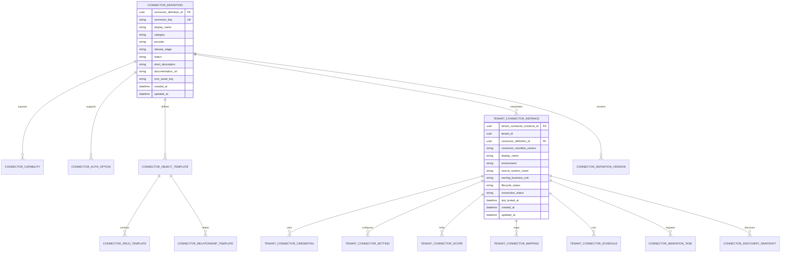

# Connector Catalog Data Store

## Purpose

The Connector Catalog is the tenant-admin entry point for selecting an enterprise source system and configuring a governed ingestion into Integrity Sentinel.

The catalog must support two related concerns:

- A global connector definition managed by Integrity Sentinel platform administrators.
- A tenant-specific connector instance configured by a Tenant Admin for a real source system, business unit, authentication method, ingestion scope, and schedule.

Platform-managed connector definitions should be versioned as deployable catalog manifests and published into the operational database. The manifest is the source of truth for connector templates, capabilities, object definitions, relationship templates, governance defaults, and default mappings. The operational database stores the currently published catalog records, tenant connector instances, credentials metadata, discovery snapshots, tenant-specific overrides, schedules, and migration state.

For the first detailed design pass, Integrity Sentinel assumes Workday is the primary system of record for employee and organization data. Custom business applications, such as Award Nominations, are modeled as tenant-owned enterprise source systems that can be configured through the same catalog experience.

---

## Product Scope

### Tenant Admin Tasks

- Browse available connectors by enterprise source-system category.
- Understand what data domains a connector can provide.
- See required permissions, authentication methods, and supported sync modes.
- Select a connector and create a tenant-specific source connection.
- Configure environment, ownership, credentials, ingestion mode, metadata discovery, data scope, and downstream processing behavior.
- Save a draft connector configuration before credentials or policy approval are complete.

### Platform Admin Tasks

- Publish supported connector types.
- Version platform-approved connector manifests.
- Define connector capability metadata.
- Define source object templates, relationship templates, sensitivity defaults, and required mappings.
- Publish platform-approved templates for custom application connectors.
- Control which connectors are generally available, preview-only, deprecated, or tenant-restricted.
- Review connector capability changes and create migration tasks for affected tenant connector instances.

---

## Source-System Categories

| Category | Examples | Primary Integrity Use |
|---|---|---|
| HR / Employee Systems | Workday | Employee, manager, department, location, job profile, worker lifecycle, organization hierarchy |
| Custom Applications | Award Nominations | Nomination events, nominators, nominees, approvers, award categories, business justification metadata |
| ERP / Finance | Oracle ERP, SAP S/4HANA | Cost centers, ledgers, payments, expense events |
| Procurement | Coupa, Ariba | Vendors, purchase orders, invoices, approval chains |
| Identity & Access | Entra ID, Okta | Users, groups, roles, access changes, privileged access events |
| Collaboration Metadata | Microsoft 365, Slack | Communication metadata, group membership, channel membership, document activity metadata |

---

## Logical Data Model



---

## Core Tables

### connector_definition

Global catalog record shown to Tenant Admins before configuration.

| Attribute | Type | Required | Notes |
|---|---:|---:|---|
| connector_definition_id | UUID | Yes | Stable platform identifier. |
| connector_key | String | Yes | Machine key, for example `workday_hcm` or `custom_award_nominations`. |
| display_name | String | Yes | User-facing connector name. |
| category | Enum | Yes | HR, ERP, Procurement, Identity, Collaboration, CustomApplication. |
| provider | String | Yes | Vendor or owning application group. |
| release_stage | Enum | Yes | GA, Preview, PrivatePreview, Deprecated. |
| status | Enum | Yes | Active, Hidden, Disabled. |
| short_description | String | Yes | Catalog card description. |
| long_description | Text | No | Detail panel description. |
| icon_asset_key | String | No | Reference to managed catalog asset. |
| documentation_url | String | No | Admin-facing setup documentation. |
| support_contact | String | No | Platform or tenant support route. |
| default_sync_modes | JSON | Yes | Allowed values: ManualImport, ScheduledBatch, EventStream. |
| default_metadata_policy | JSON | Yes | Default exclusions and sensitivity posture. |
| current_manifest_version | String | Yes | Published manifest version currently active in the catalog. |
| created_at / updated_at | DateTime | Yes | Audit timestamps. |

### connector_definition_version

Versioned platform manifest record for connector definitions.

| Attribute | Type | Required | Notes |
|---|---:|---:|---|
| connector_definition_version_id | UUID | Yes | Stable version record ID. |
| connector_definition_id | UUID | Yes | Parent connector definition. |
| manifest_version | String | Yes | Semantic or date-based version, for example `1.2.0`. |
| manifest_uri | String | Yes | Immutable artifact location for the deployable manifest. |
| manifest_hash | String | Yes | Integrity hash for the manifest payload. |
| release_notes | Text | No | Admin-facing summary of capability, mapping, or governance changes. |
| migration_required | Boolean | Yes | True when existing tenant instances need migration review. |
| published_by | UUID | Yes | Platform admin or release process actor. |
| published_at | DateTime | Yes | Publish timestamp. |

### connector_capability

Describes what the connector can do before a tenant configures it.

| Attribute | Type | Required | Notes |
|---|---:|---:|---|
| connector_capability_id | UUID | Yes | Stable capability identifier. |
| connector_definition_id | UUID | Yes | Parent connector definition. |
| capability_type | Enum | Yes | EntityRead, EventRead, RelationshipRead, AttachmentRead, IncrementalSync, Webhook, DeltaToken, MetadataDiscovery. |
| display_name | String | Yes | Admin-facing name. |
| description | Text | No | Explains impact and limitations. |
| is_required_for_minimum_setup | Boolean | Yes | Indicates baseline capability. |
| requires_privileged_permission | Boolean | Yes | Flags capabilities needing elevated access. |

### connector_auth_option

Defines supported authentication patterns.

| Attribute | Type | Required | Notes |
|---|---:|---:|---|
| connector_auth_option_id | UUID | Yes | Stable auth option identifier. |
| connector_definition_id | UUID | Yes | Parent connector definition. |
| auth_type | Enum | Yes | OAuth2, ClientCredentials, APIKey, BasicAuth, SFTPKey, SignedWebhook, ManualUpload. |
| display_name | String | Yes | Admin-facing auth label. |
| required_secret_fields | JSON | Yes | Secret names only, never secret values. |
| required_non_secret_fields | JSON | No | Tenant URL, API version, report path, integration user name. |
| permission_scopes | JSON | No | Provider-specific scopes or security domains. |
| supports_secret_rotation | Boolean | Yes | Whether rotation can be tracked by the platform. |
| test_connection_strategy | Enum | Yes | Ping, MetadataRead, SampleObjectRead, UploadValidation. |

### connector_object_template

Defines source objects the connector can discover or ingest.

| Attribute | Type | Required | Notes |
|---|---:|---:|---|
| connector_object_template_id | UUID | Yes | Stable object template identifier. |
| connector_definition_id | UUID | Yes | Parent connector definition. |
| source_object_key | String | Yes | Provider object key, for example `worker`, `supervisory_org`, `award_nomination`. |
| display_name | String | Yes | Admin-facing object name. |
| domain | String | Yes | Employee, Organization, Recognition, Transaction, Approval, Access. |
| default_integrity_entity | String | No | Suggested ontology entity or event type. |
| default_enabled | Boolean | Yes | Included by default in scope. |
| supports_incremental_sync | Boolean | Yes | Whether object can be sync-windowed. |
| estimated_volume_band | Enum | No | Low, Medium, High, VeryHigh. |
| retention_class | Enum | Yes | Operational, Evidence, AuditOnly, MetadataOnly, SemanticEvidence. |

### connector_field_template

Defines available fields and governance defaults.

| Attribute | Type | Required | Notes |
|---|---:|---:|---|
| connector_field_template_id | UUID | Yes | Stable field template identifier. |
| connector_object_template_id | UUID | Yes | Parent source object template. |
| source_field_key | String | Yes | Provider field or custom app column key. |
| display_name | String | Yes | Admin-facing field name. |
| data_type | Enum | Yes | String, Number, Boolean, Date, DateTime, Currency, Enum, JSON, Text. |
| integrity_concept | String | No | Suggested ontology field mapping. |
| is_identifier | Boolean | Yes | True for stable source IDs. |
| is_required_for_mapping | Boolean | Yes | True when ingestion cannot run without it. |
| sensitivity_class | Enum | Yes | Public, Internal, Confidential, Restricted, SensitivePersonal, FreeText, Secret. |
| default_ingestion_behavior | Enum | Yes | Include, Exclude, Tokenize, Hash, Redact, MetadataOnly, SemanticEvidence. |
| filterable | Boolean | Yes | Field can be used in ingestion scope filters. |
| previewable | Boolean | Yes | Field can appear in preview samples. |

### connector_relationship_template

Defines expected relationships for graph construction.

| Attribute | Type | Required | Notes |
|---|---:|---:|---|
| connector_relationship_template_id | UUID | Yes | Stable relationship template identifier. |
| connector_object_template_id | UUID | Yes | Source object where relationship originates. |
| relationship_key | String | Yes | Machine key, for example `worker_reports_to_manager`. |
| display_name | String | Yes | Admin-facing relationship name. |
| source_integrity_concept | String | Yes | Source ontology concept. |
| target_integrity_concept | String | Yes | Target ontology concept. |
| relationship_type | String | Yes | ReportsTo, MemberOf, NominatedBy, ApprovedBy, BelongsToCostCenter. |
| required_source_field_key | String | Yes | Field needed to resolve source. |
| required_target_field_key | String | Yes | Field needed to resolve target. |
| default_enabled | Boolean | Yes | Included by default in graph update. |

---

## Tenant Configuration Tables

### tenant_connector_instance

Tenant-owned configuration shell for one selected connector.

| Attribute | Type | Required | Notes |
|---|---:|---:|---|
| tenant_connector_instance_id | UUID | Yes | Stable tenant connector instance ID. |
| tenant_id | UUID | Yes | Tenant boundary. |
| connector_definition_id | UUID | Yes | Selected catalog connector. |
| connector_manifest_version | String | Yes | Connector manifest version active for this tenant instance. |
| display_name | String | Yes | Tenant-defined name, for example `Workday Production`. |
| source_system_name | String | Yes | Real source, for example `Workday HCM` or `Award Nominations`. |
| environment | Enum | Yes | Production, Sandbox, Test, Development. |
| owning_business_unit | String | No | HR, People Operations, Corporate Awards, Finance. |
| data_owner_contact | String | No | Business data owner. |
| technical_owner_contact | String | No | Integration or app owner. |
| lifecycle_status | Enum | Yes | Draft, PendingApproval, Active, Paused, Disabled, Archived. |
| connection_status | Enum | Yes | NotConfigured, PendingSecrets, TestFailed, Connected, Expired, Revoked. |
| selected_sync_mode | Enum | No | ManualImport, ScheduledBatch, EventStream. |
| last_tested_at | DateTime | No | Last connection test timestamp. |
| last_successful_sync_at | DateTime | No | Last completed ingestion. |
| created_by / updated_by | UUID | Yes | Admin audit. |
| created_at / updated_at | DateTime | Yes | Audit timestamps. |

### tenant_connector_credential

Stores credential metadata only. Secret values are stored in the tenant-isolated secret store.

| Attribute | Type | Required | Notes |
|---|---:|---:|---|
| tenant_connector_credential_id | UUID | Yes | Stable credential metadata ID. |
| tenant_connector_instance_id | UUID | Yes | Parent tenant connector instance. |
| auth_type | Enum | Yes | Selected authentication method. |
| secret_store_reference | String | Yes | Pointer to Key Vault or equivalent. |
| non_secret_config | JSON | No | Tenant URL, API version, report endpoint, SFTP path. |
| credential_status | Enum | Yes | Missing, Valid, ExpiringSoon, Expired, Revoked. |
| expires_at | DateTime | No | When available from provider. |
| last_rotated_at | DateTime | No | Rotation audit. |

### tenant_connector_setting

Stores non-secret connector setup values that do not belong in credentials, scope, or schedule.

| Attribute | Type | Required | Notes |
|---|---:|---:|---|
| tenant_connector_setting_id | UUID | Yes | Stable setting ID. |
| tenant_connector_instance_id | UUID | Yes | Parent tenant connector instance. |
| setting_key | String | Yes | Machine key, for example `workday_report_group` or `custom_app_schema_name`. |
| setting_value | JSON | Yes | Non-secret value. |
| setting_source | Enum | Yes | AdminInput, Discovery, Default, Policy. |
| is_admin_editable | Boolean | Yes | Controls whether the value appears editable in setup screens. |
| updated_by | UUID | Yes | Admin audit. |
| updated_at | DateTime | Yes | Audit timestamp. |

### tenant_connector_scope

Represents the Ingestion Policy / Metadata Scope for this connector.

| Attribute | Type | Required | Notes |
|---|---:|---:|---|
| tenant_connector_scope_id | UUID | Yes | Stable scope ID. |
| tenant_connector_instance_id | UUID | Yes | Parent tenant connector instance. |
| scope_name | String | Yes | Admin-facing policy name. |
| included_object_keys | JSON | Yes | Source object keys included for ingestion. |
| excluded_object_keys | JSON | No | Explicit exclusions. |
| included_field_keys | JSON | No | Explicit field includes. |
| excluded_field_keys | JSON | No | Explicit field exclusions. |
| filter_expression | JSON | No | Structured filters for departments, regions, dates, statuses, categories. |
| metadata_only | Boolean | Yes | Prevents evidence payload storage when true. |
| sensitive_field_policy | JSON | Yes | Redaction, hashing, tokenization, exclusion rules. |
| approval_status | Enum | Yes | Draft, ReviewRequired, Approved, Rejected. |
| approved_by | UUID | No | Compliance or tenant admin approver. |
| approved_at | DateTime | No | Approval timestamp. |

### tenant_connector_mapping

Stores tenant-specific ontology mapping overrides after metadata discovery.

| Attribute | Type | Required | Notes |
|---|---:|---:|---|
| tenant_connector_mapping_id | UUID | Yes | Stable mapping ID. |
| tenant_connector_instance_id | UUID | Yes | Parent tenant connector instance. |
| source_object_key | String | Yes | Source object being mapped. |
| source_field_key | String | No | Source field when mapping a field. |
| source_relationship_key | String | No | Relationship key when mapping a relationship. |
| integrity_concept | String | Yes | Target ontology entity, event, field, or relationship. |
| mapping_type | Enum | Yes | Entity, Event, Field, Relationship. |
| required | Boolean | Yes | Whether validation must pass before activation. |
| mapping_confidence | Decimal | No | Suggested mapping confidence from discovery. |
| mapping_status | Enum | Yes | Suggested, Accepted, Overridden, Rejected, Missing. |
| transform_expression | JSON | No | Optional structured transform for normalization. |
| updated_by | UUID | Yes | Admin audit. |
| updated_at | DateTime | Yes | Audit timestamp. |

### tenant_connector_schedule

Defines run cadence and downstream processing toggles.

| Attribute | Type | Required | Notes |
|---|---:|---:|---|
| tenant_connector_schedule_id | UUID | Yes | Stable schedule ID. |
| tenant_connector_instance_id | UUID | Yes | Parent tenant connector instance. |
| run_mode | Enum | Yes | RunOnce, ScheduledBatch, EventStream. |
| schedule_timezone | String | No | IANA time zone for scheduled batch. |
| schedule_expression | String | No | Platform-managed schedule expression. |
| backfill_start_at | DateTime | No | Initial backfill boundary. |
| backfill_end_at | DateTime | No | Optional bounded backfill end. |
| failure_handling | Enum | Yes | Stop, Retry, SkipInvalidRecords, Quarantine. |
| notification_recipients | JSON | No | Admin and owner contacts. |
| update_graph | Boolean | Yes | Downstream graph write toggle. |
| run_risk_scoring | Boolean | Yes | Downstream scoring toggle. |
| generate_alerts | Boolean | Yes | Alert generation toggle. |
| enable_ai_summaries | Boolean | Yes | AI investigation summary toggle. |

### connector_discovery_snapshot

Immutable record of discovered metadata at a point in time.

| Attribute | Type | Required | Notes |
|---|---:|---:|---|
| connector_discovery_snapshot_id | UUID | Yes | Stable discovery ID. |
| tenant_connector_instance_id | UUID | Yes | Parent tenant connector instance. |
| discovered_at | DateTime | Yes | Snapshot timestamp. |
| source_schema_version | String | No | Provider or custom app schema version. |
| discovered_objects | JSON | Yes | Object list with counts and capabilities. |
| discovered_fields | JSON | Yes | Field list, data types, sensitivity hints. |
| discovered_relationships | JSON | No | Relationship list and resolvability. |
| estimated_record_counts | JSON | No | Count estimates by object. |
| validation_findings | JSON | No | Missing identifiers, permissions, policy warnings. |

### connector_migration_task

Tracks migration work created when a connector definition or capability changes.

| Attribute | Type | Required | Notes |
|---|---:|---:|---|
| connector_migration_task_id | UUID | Yes | Stable migration task ID. |
| tenant_connector_instance_id | UUID | Yes | Affected tenant connector instance. |
| from_manifest_version | String | Yes | Current tenant version. |
| to_manifest_version | String | Yes | Target connector version. |
| migration_reason | Enum | Yes | CapabilityAdded, CapabilityRemoved, FieldChanged, MappingChanged, GovernanceChanged, AuthChanged. |
| impact_summary | Text | Yes | Admin-facing explanation of what changed. |
| required_action | Enum | Yes | None, Review, RemapFields, ReapproveScope, RotateCredentials, ReauthorizeConnector. |
| migration_status | Enum | Yes | Pending, InReview, Applied, Deferred, Failed, NotApplicable. |
| created_at | DateTime | Yes | Task creation timestamp. |
| completed_at | DateTime | No | Completion timestamp. |

---

## Catalog Card Attributes

These attributes should be available without opening the full connector setup flow.

| UI Element | Source Attribute |
|---|---|
| Connector name | connector_definition.display_name |
| Category | connector_definition.category |
| Provider | connector_definition.provider |
| Description | connector_definition.short_description |
| Data domains | connector_object_template.domain grouped by connector |
| Supported sync modes | connector_definition.default_sync_modes |
| Required permissions | connector_auth_option.permission_scopes and connector_capability.requires_privileged_permission |
| Governance posture | connector_field_template.sensitivity_class and default_ingestion_behavior summary |
| Availability | connector_definition.release_stage and status |
| Last configured status | tenant_connector_instance.lifecycle_status and connection_status for this tenant |

---

## Connector Detail Attributes

When a Tenant Admin opens a connector detail panel, the UI should show:

- Overview: description, provider, category, support contact, documentation link.
- Supported data domains: entity objects, event objects, relationship templates.
- Authentication options: supported methods, required non-secret fields, permission scopes.
- Sync options: manual import, scheduled batch, event stream, incremental sync support.
- Required mappings: identifiers and required ontology concepts.
- Governance defaults: sensitive field behavior, free-text defaults, attachment behavior, evidence retention class.
- Known limitations: unsupported objects, event latency, API limits, field-level restrictions.
- Tenant status: existing instances, last successful sync, failed connection tests, pending approvals.

---

## Initial Connector Definitions

### Workday HCM

Workday is treated as the employee and organization system of record.

```json
{
  "connector_key": "workday_hcm",
  "display_name": "Workday HCM",
  "category": "HR",
  "provider": "Workday",
  "release_stage": "GA",
  "status": "Active",
  "default_sync_modes": ["ScheduledBatch"],
  "domains": ["Employee", "Organization", "Location", "WorkerLifecycle"],
  "auth_options": ["OAuth2", "ClientCredentials"],
  "minimum_required_objects": ["worker", "supervisory_organization"],
  "default_metadata_policy": {
    "free_text": "Exclude",
    "sensitive_personal": "Exclude",
    "identifiers": "Include",
    "relationships": "Include",
    "attachments": "Exclude"
  }
}
```

Suggested source objects:

| Source Object | Integrity Concept | Default | Notes |
|---|---|---:|---|
| worker | Employee | Include | Stable worker ID, name, work email, status, manager ID. |
| supervisory_organization | OrganizationUnit | Include | Department and management hierarchy. |
| job_profile | Role | Include | Job family, level, title metadata. |
| location | Location | Include | Country, region, site. |
| worker_lifecycle_event | Event | Include | Hire, termination, transfer, leave, manager change. |

Hidden source objects:

| Source Object | Reason |
|---|---|
| compensation | Hidden for the first release because compensation data is not required for baseline integrity graph use cases. |
| personal_information | Hidden for the first release because personal information is not required for baseline integrity graph use cases. |

Required fields for minimum setup:

| Field | Integrity Concept | Required | Default Behavior |
|---|---|---:|---|
| worker_id | Employee.identifier | Yes | Include |
| employee_status | Employee.status | Yes | Include |
| manager_worker_id | Employee.managerIdentifier | Yes | Include |
| supervisory_org_id | OrganizationUnit.identifier | Yes | Include |
| work_email | Employee.workEmail | No | Hash |
| location_id | Location.identifier | No | Include |

### Award Nominations

Award Nominations is modeled as a tenant custom application. It provides recognition and approval events that can be correlated with HR hierarchy, manager relationships, access patterns, and procurement or finance activity.

```json
{
  "connector_key": "custom_award_nominations",
  "display_name": "Award Nominations",
  "category": "CustomApplication",
  "provider": "Tenant Custom App",
  "release_stage": "Preview",
  "status": "Active",
  "default_sync_modes": ["ManualImport", "ScheduledBatch"],
  "domains": ["Recognition", "Approval", "EmployeeEvent"],
  "auth_options": ["APIKey", "SFTPKey", "ManualUpload"],
  "minimum_required_objects": ["award_nomination"],
  "default_metadata_policy": {
    "free_text": "SemanticEvidence",
    "sensitive_personal": "Exclude",
    "identifiers": "Include",
    "relationships": "Include",
    "attachments": "Exclude"
  }
}
```

Suggested source objects:

| Source Object | Integrity Concept | Default | Notes |
|---|---|---:|---|
| award_nomination | RecognitionEvent | Include | Core nomination event. |
| nominee | Employee | Include | Resolves to Workday worker ID where possible. |
| nominator | Employee | Include | Resolves to Workday worker ID where possible. |
| nomination_approval | Approval | Include | Approver, status, timestamp. |
| award_category | RecognitionCategory | Include | Category, eligibility rules, monetary/non-monetary flag. |
| justification_text | EvidenceText | Include | Stored as governed semantic evidence in the vector store. |
| attachment | EvidenceAttachment | Exclude | Out of scope for initial connector. |

Required fields for minimum setup:

| Field | Integrity Concept | Required | Default Behavior |
|---|---|---:|---|
| nomination_id | RecognitionEvent.identifier | Yes | Include |
| nominee_worker_id | Employee.identifier | Yes | Include |
| nominator_worker_id | Employee.identifier | Yes | Include |
| submitted_at | Event.timestamp | Yes | Include |
| award_category_id | RecognitionCategory.identifier | Yes | Include |
| approval_status | Approval.status | No | Include |
| approver_worker_id | Approval.actor | No | Include |
| justification_text | Evidence.text | No | SemanticEvidence |

Key relationships:

| Relationship | Source | Target | Notes |
|---|---|---|---|
| NominatedBy | RecognitionEvent | Employee | Nominator relationship. |
| NominatedFor | RecognitionEvent | Employee | Nominee relationship. |
| ApprovedBy | RecognitionEvent | Employee | Approval relationship when present. |
| BelongsToCategory | RecognitionEvent | RecognitionCategory | Award category relationship. |
| EmployeeBelongsToOrg | Employee | OrganizationUnit | Resolved from Workday, not the custom app. |

---

## Tenant Admin Configuration Flow

The Connector Catalog data store supports the existing admin-led ingestion screens as follows:

| Screen | Data Store Usage |
|---|---|
| Connector Catalog | Reads connector_definition, connector_capability, connector_auth_option, connector_object_template, latest tenant_connector_instance. |
| Source Connection Setup | Creates or updates tenant_connector_instance, tenant_connector_credential, tenant_connector_setting. |
| Metadata Discovery | Writes connector_discovery_snapshot and compares discovered metadata to templates. |
| Ingestion Scope & Metadata Filters | Creates tenant_connector_scope from selected objects, fields, filters, and sensitive-field rules. |
| Preview & Governance Validation | Uses tenant_connector_scope plus connector_discovery_snapshot to estimate records, validate permissions, and surface warnings. |
| Ontology Mapping | Uses connector_object_template, connector_field_template, and connector_relationship_template as defaults, then stores tenant overrides in tenant_connector_mapping. |
| Schedule & Run Ingestion | Creates tenant_connector_schedule and ingestion run records. |
| Ingestion Monitor | Reads ingestion runs, stage counts, validation findings, and downstream processing status. |

---

## Design Decisions

| Question | Decision |
|---|---|
| Where should connector definitions live? | Platform-managed definitions should be versioned as deployable catalog manifests, then published into the operational database for runtime lookup and tenant configuration. This keeps connector templates reviewable, testable, and releasable while preserving fast tenant-specific queries in the operational store. |
| How should custom application connectors start? | Custom application connectors should begin from platform-approved templates. Tenant admins can configure and map them, but the baseline object model, governance posture, and required fields come from an approved template. |
| How should Workday compensation and personal information appear? | Workday compensation and personal-information objects should be hidden from the Tenant Admin catalog and discovery flow for the first release. |
| How should Award Nominations justification text be handled? | Award Nominations should support justification text as governed semantic evidence in the vector store. It should still be scoped, previewed, and auditable. |
| Should connector capability changes affect existing tenant instances? | Yes. Capability changes should create connector migration tasks for affected tenant connector instances. |

---

## Governance Rules

- Secret values must never be stored in the Connector Catalog database.
- All tenant connector records must include tenant_id and must be query-filtered by tenant boundary.
- Free-text fields are excluded by default unless the connector definition explicitly permits MetadataOnly or governed semantic evidence retention.
- Attachments are excluded by default for Workday and Award Nominations.
- Workday employee identifiers are the preferred cross-system join key for HR-linked custom applications.
- Custom application connectors must begin from platform-approved templates and define identifier fields, timestamp fields, data owner, and at least one ingestion method before activation.
- A connector instance cannot move from Draft to Active until connection test, metadata discovery, scope approval, and required ontology mappings pass validation.
- Connector capability, mapping, authentication, or governance changes must create migration tasks for affected active tenant connector instances.
- Hidden Workday objects must not appear in catalog cards, metadata discovery results, preview, or Tenant Admin mapping screens.

---

## Deferred Design Questions

- What review workflow should platform-approved custom application templates follow before publication?
- What manifest schema should be used for connector definition versioning?
- What retention and redaction controls are required for Award Nominations justification text once it is stored as semantic evidence?
- Should migration tasks block scheduled ingestion, or only warn Tenant Admins until a deadline?
