# Admin Configuration Workflow Screen Mockups

## Purpose

This folder contains screen-level mockups for the Tenant Admin flow used to select a connector from the Connector Catalog and configure it for governed ingestion.

The mockups focus on Workday HCM as the employee and organization system of record, with Award Nominations as a platform-approved custom application template.

## Screen Sequence

| Step | Screen | File |
|---:|---|---|
| 1 | Connector Catalog | `01-connector-catalog.md` |
| 2 | Connector Detail | `02-connector-detail.md` |
| 3 | Source Connection Setup | `03-source-connection-setup.md` |
| 4 | Metadata Discovery | `04-metadata-discovery.md` |
| 5 | Ingestion Scope | `05-ingestion-scope.md` |
| 6 | Governance Preview | `06-governance-preview.md` |
| 7 | Ontology Mapping | `07-ontology-mapping.md` |
| 8 | Schedule & Downstream Processing | `08-schedule-and-processing.md` |
| 9 | Review & Activate | `09-review-and-activate.md` |
| 10 | Connector Instance Detail | `10-connector-instance-detail.md` |

## Clickable Prototype

Open `index.html` in a browser to review the interactive app-style mockups.

Prototype files:

- `index.html`
- `styles.css`
- `app.js`

## Design References

- `../../admin-led-ingestion-mockups.md`
- `../../admin-led-ingestion-workflow.mmd`
- `../../connector-catalog-data-store.md`

## Shared UI Structure

Each screen assumes the Tenant Admin is inside:

```text
Integrity Sentinel
  Admin
    Data Sources
      Connector Catalog
```

Common page regions:

- Left navigation: Admin sections.
- Page header: title, environment, tenant context, primary action.
- Main work area: screen-specific task.
- Right panel: setup progress, policy warnings, data-store bindings, and help links.

## Primary Flow

```mermaid
flowchart LR
    CATALOG["Connector Catalog"]
    DETAIL["Connector Detail"]
    CONNECT["Source Connection Setup"]
    DISCOVER["Metadata Discovery"]
    SCOPE["Ingestion Scope"]
    PREVIEW["Governance Preview"]
    MAP["Ontology Mapping"]
    SCHEDULE["Schedule & Processing"]
    ACTIVATE["Review & Activate"]
    INSTANCE["Connector Instance Detail"]

    CATALOG --> DETAIL
    DETAIL --> CONNECT
    CONNECT --> DISCOVER
    DISCOVER --> SCOPE
    SCOPE --> PREVIEW
    PREVIEW --> MAP
    MAP --> SCHEDULE
    SCHEDULE --> ACTIVATE
    ACTIVATE --> INSTANCE
```



